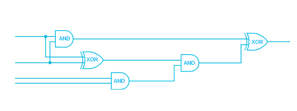
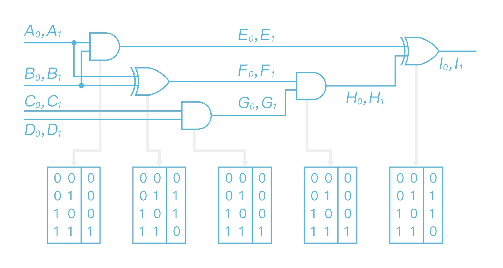
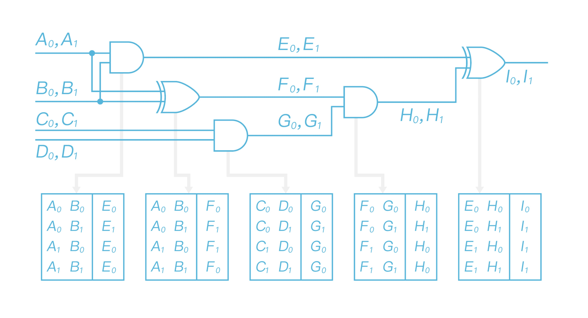
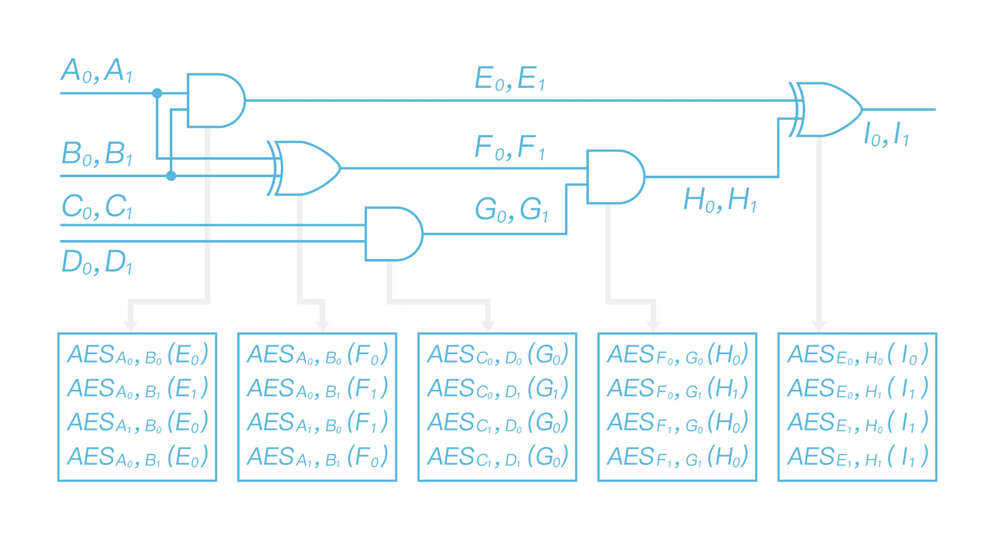
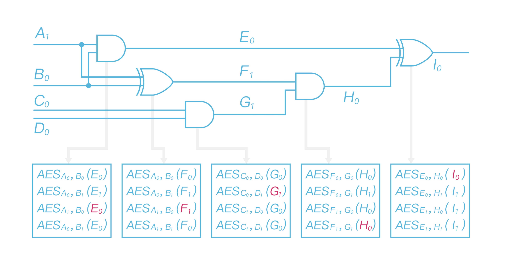

# Garbled circuit protocol

Before technique details, one should define the security goal, which is called the [security model](security_model.md) in cryptography. The [semi-honest model](semi_honest_adversary.md) and [malicious model](malicious_adversary.md) are widely considered to capture the capabilities of adversaries.

In this article, we introduce the classic Yao's garbled circuit in the two-party setting, it is also one of the most efficient constructions by now.

Alice and Bob who have private input $x$ and $y$ respectively, want to jointly compute a function f and both obtain the result $z=f(x,y)$ without revealing anything else. One should first use a circuit compiler to convert the function $f$ into boolean circuit that consists of AND and XOR gate (as shown in Figure 1). Since most real-world programs written in advanced language contain complex data structures, this is a highly non-trivial task.

Figure 1  

For the easy understanding of the description, we assume that $x$, $y$ are both $2$-bit strings, and $x$ feeds into the first two wire in the left, and $y$ feeds into the last two wires in the figure above.

Alice takes as input the circuit, and writes down all the truth table of each gate. Then it chooses two uniformly random string, which is called labels, for each gate to represent 0 or 1 as in Figure 2. Note that, although Alice does not know the input of $C$, $D$ wires, she still chooses labels to represent 0 and 1 in each wire.

Figure 2  

After choosing the labels, Alice replaces the truth table with labels according to the topology of the circuit. Take the left-up two gates as an example. It has $A$ and $B$ wires as inputs and $E/F$ wire as output. Then Alice replaces the first two truth tables as:

Figure 3  

After replacing all the truth tables, Alice gets a "label table" as in Figure 4.

Figure 4  

For each gate Alice garbles the gates using the labels. I.e., for each row of the label table, Alice encrypts the output label with the input label as keys to a double encryption. More specifically, for the first row in the first label table, Alice uses $A_0$ and $B_0$ as keys to AES and encrypts $E_0$ as AES$_{A_0}$(AES$_{B_0}$($E_0$)), all the other rows and gates are doing in the similar way. Then Alice gets a garbled circuit as in Figure 5.

Figure 5  

Suppose Alice's input $x = 10$, Bob's input $y=01$. Alice then sends the garbled circuit (all the garbled gate) to Bob, together with $A_1$ and $B_0$, according to her input bits, and the meaning of output labels (i.e. the relations $I_0$ -> $0$; $I_1$ -> $1$). Note that Bob can not get any input information of Alice from $A_1$ and $B_0$, since they are just random strings, and the relation of output labels will not leak any additional information of the output value.

Before Bob evaluates the garbled circuit, he has to obtain the input labels according to his input information. Since the labels are sampled by Alice, he has to run a "transfer protocol" with Alice to get the labels without telling her the inputs in plain. This "transfer protocol" is called oblivious transfer in cryptography, since it is a very fundamental cryptographic primitive, we will not get into the details, but list the properties below.

1. Alice takes labels $X_0$, $X_1$ as input, and Bob takes bit $b=0/1$ as input. At the end of the protocol, Bob will get $X_b$.

2. Alice does not know which label is chosen by Bob.

3. Bob does not know the other label $X_{1-b}$.

After running the oblivious transfer protocol with Alice, Bob gets the labels $C_0$, $D_1$ according to his input, and then he could evaluate the garbled circuit. For each garbled gate, Bob decrypts four ciphertexts with the input labels as AES keys, note that he could only get one meaningful output label, and then iteratively decrypts the garbled gate to get the output label $I_0$ . Since Bob knows the meaning of $I_0$, he will get the output $0$, and send it to Alice.The whole evaluation process is described as in Figure 6.

Figure 6  

So far, we illustrate the basic principle of Yao's garbled circuits. For almost 40 years, many optimized techniques are proposed to improve this basic protocol. Free-XOR (no encryption for XOR gate), row reduction and half gate (reduce the number of each AND gate to 2 ciphertexts) techniques and hardware acceleration (using AES-NI ) significantly improve the efficiency of garbled circuit.

Garbling is one of the most useful and practical techniques to implement MPC protocols. The computation cost of garbling is very low since using AES-NI. The round complexity of garbling-based protocol is constant, which is good in practice. However, the amount of data in communication is relatively large, and it is more suitatble for high-bandwidth network environment.

#### References

1. Protocols for secure computations. Andrew C. Yao.
2. How to Generate and Exchange Secrets. Andrew C. Yao.
3. How to exchange secrets with oblivious transfer. Michael O. Rabin.
4. Improved Garbled Circuit: Free XOR Gates and
Applications. Vladimir Kolesnikov, Thomas Schneider.
5. Practical Garbled Circuit Optimizations. Mike Rosulek. [https://web.engr.oregonstate.edu/~rosulekm/](https://web.engr.oregonstate.edu/~rosulekm/)

Author: Xiang Xie @PlatON
